# Notes

**Note01:** There is a bug with the github DownloadZIP(".map" asset files are Git LFS files, Github DownloadZIP results in the ".map" file only 1KB).  **You should clone this repository by HTTPs or SSH of this git, Not by Github DownloadZIP.**

# Related Links

**Demo Video**: https://youtu.be/gfurnXhF3OY

**UE5 Example Demo on GitLab**: https://gitlab.com/UEMarketplaceSubmission_Public/uemathexpression_public
**Discord.com Server**: https://discord.gg/8ptrDrMXVN

# Introduce

## PRODUCT TITLE：

**UEMathExpressionProceduralMesh**: Math Formula(Math Expression) Based Procedural Mesh and Trajectory For UE

## SHORT DESCRIPTION：

Offers a powerful tool for Unreal Engine 5, enabling the creation of complex procedural meshes (models) and dynamic trajectory lines (capable of driving Actors along the path) based on mathematical expressions (formulas), applicable in both editor and runtime environments.  Also includes: Numeric Calculator for property panel，Slate Numeric Calculator(for Editor) and UMG Numeric Calculator(for Runtime). Integrate the “**[**ExprTK**](https://github.com/ArashPartow/exprtk)**”(A Mathematical Expression Parsing And Evaluation Library) into UE5.

## LONG DESCRIPTION：

**Documentation and Example Project:** https://github.com/YHK-UEPlugins-Public/016_UEMathExpression_Public

**Overview:**
UEMathExpression is an innovative plugin designed for Unreal Engine that allows developers to generate procedural 3D mesh models, wireframes, line trajectories, or Spline paths directly from mathematical expressions (formulas). This plugin can be utilized within the editor and also dynamically create or modify content during game runtime, bringing endless possibilities to games and interactive applications.

Numeric Calculator: Numeric Calculator for Editor property panel(Can use a calculator to any numeric  input box)，Slate Numeric Calculator(for Editor) and UMG Numeric Calculator(for Runtime) .

Integrated the “*[ExprTK](https://github.com/ArashPartow/exprtk)”(A Mathematical Expression Parsing And Evaluation Library) into UE5: Can use a blueprint function to Evaluate any constant Mathematical Expressions(such as: “2+(3-5)\*10+3^5+sqrt(9)”) and any Multivariate Expressions.

It comes with over 30 preset procedural models and trajectory lines, as well as more than 40 practical materials.

UEMathExpression greatly expands the creativity and flexibility of Unreal Engine.

It also includes a custom mathematical calculator Slate tool and UMG widget.

An extended “PlaceActors” tool panel makes integrating procedural elements into scenes easier than ever.

Whether in the design phase or in the final game, UEMathExpression is a powerful asset that combines the precision of mathematics with the creativity of art.

**Details:**

1. Procedural model and trajectory line creation entirely based on mathematical formulas (expressions);
2. Create procedural models using mathematical formulas. These can be procedural mesh models, lines, meshes, or Splines;
3. Create trajectories with mathematical formulas, capable of driving any object along the path. Supports the generation of Spline trajectories;
4. Contains a custom mathematical calculator Slate tool and UMG widget based on mathematical expressions, usable for calculator functions in both editor and runtime;
5. Usable in both the editor and runtime. Real-time creation of procedural models or trajectory lines through mathematical formulas during gameplay;
6. Built-in with more than 30 procedural models and trajectory lines created through mathematical formulas;
7. Over 40 built-in practical materials for various models such as glass, mesh, metal, woven fabric, fur, etc.;
8. Well-configured functionality, convenient for setting up various properties related to mathematical expressions, procedural models, and procedural trajectory lines;
9. Core mathematical expression-related configuration data has been extracted into a separate DataAsset configuration method, which can be set up in EditInlineNew form or shared as a DataAsset;
10. The “PlaceActors” tool panel has been extended, facilitating the direct dragging of desired mathematical expression procedural generation Actors into the panel;
11. Supports direct dragging of procedural mesh DataAsset resources into the scene, automatically generating the corresponding procedural mesh model Actor based on the mathematical expression.

## TECHNICAL INFORMATION：

**Features:** 

- Procedural model and trajectory creation via mathematical formulas.
- Variety of models (mesh, lines, Splines) generated using formulas.
- Trajectory creation with object-driving capability, including Spline paths.
- Custom mathematical calculator tool for in-editor and runtime use.
- Real-time procedural model and trajectory creation in game environments.
- Over 30 pre-designed procedural models and trajectories.
- More than 40 materials for different model types.
- Easy setup and configuration for procedural elements.
- DataAsset configuration for mathematical expressions.
- Enhanced “PlaceActors” panel for easy procedural Actor integration.
- Drag-and-drop functionality for procedural mesh DataAssets in scenes.

**Code Modules:** 

UEMathExpression(Runtime)

UEMathExpressionEditor(Editor)

**Number of C++ Classes:** 17.

**Number of Blueprints:** 4.

**Supported Development Platforms:** Windows, Mac and Linux.

**Supported Target Build Platforms:** Win64, Mac, Linux, iOS, Android.

**Documentation and Example Project:** https://github.com/YHK-UEPlugins-Public/016_UEMathExpression_Public

# Example Introduction

## Example01: Demonstrate the use of “BPA_BasicMathExpressionsEvaluator” Actor. This Actor is designed to generate trajectories based on formulas(Math Expressions), concurrently visualize trajectory lines, and can drive other Actors to move along these trajectories.

**Map:** `'/Script/Engine.World'/UEMathExpression/MAPs/MAP_UEMathExpression_Overview_01.MAP_UEMathExpression_Overview_01'`

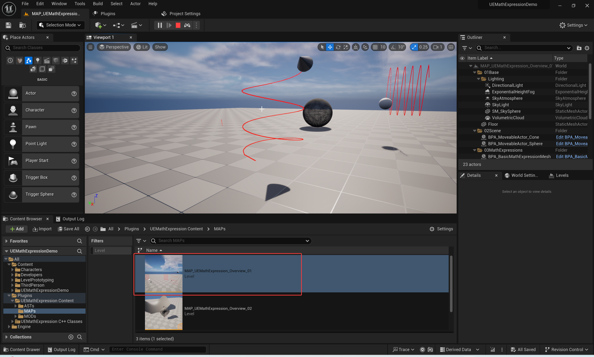

## Example02: Demonstrate the usage of “BPA_BasicMathExpressionesMesh” Actor. This is used for generating a variety of procedural mesh models and trajectory lines based on formulas(Math Expressions).

**Map:** `'/Script/Engine.World'/UEMathExpression/MAPs/MAP_UEMathExpression_Overview_02.MAP_UEMathExpression_Overview_02'`

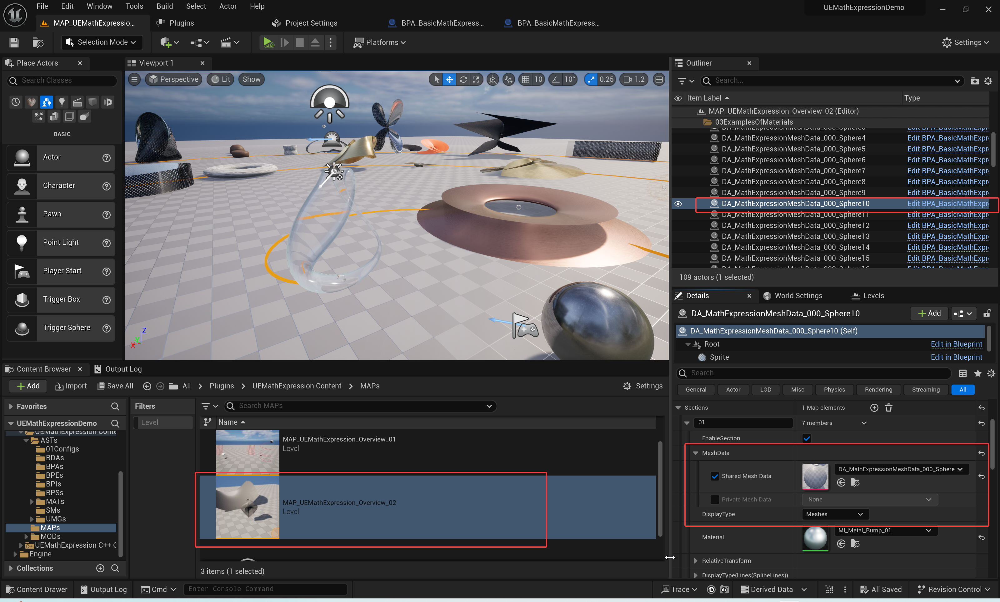

# Instructions for use

## Includes several pre-created mathematical formula(Math Expressions) mesh models, located in the plugin’s “ASTs/01Configs” folder.

“**ASTs/01Configs**” folder: `'/UEMathExpression/ASTs/01Configs/'`

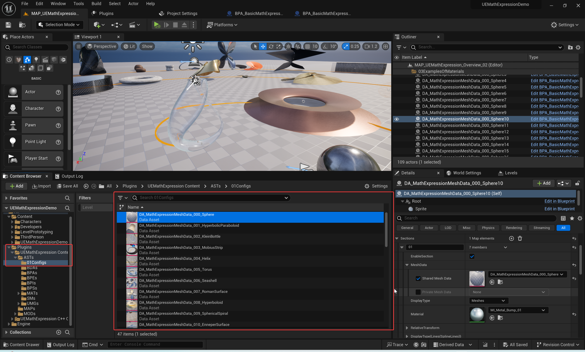

## You can copy an existing "DA_MathExpressionMeshData_000_Sphere" file from the “01Configs” folder, then modify the formula(Math Expression), click the “Rebuild Meshes” button to generate a mathematical procedural mesh, and drag the Asset file into the scene to create the corresponding Mesh Actor.

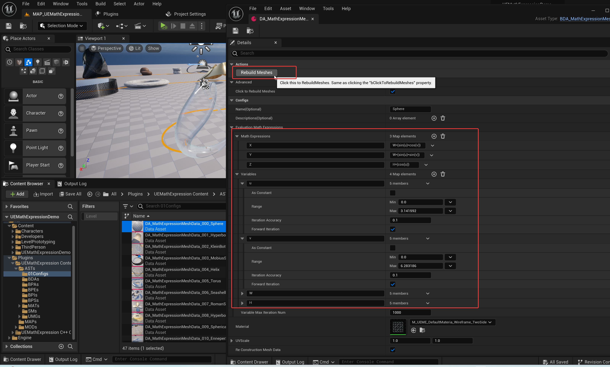

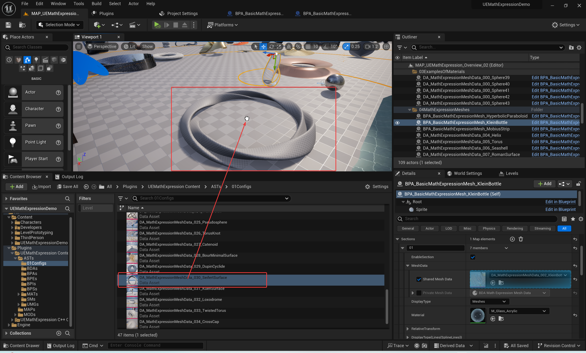

## When modifying the float parameter values of the formula(Math Expression), you can use the calculator tool provided by this plugin to perform mathematical expression calculations.

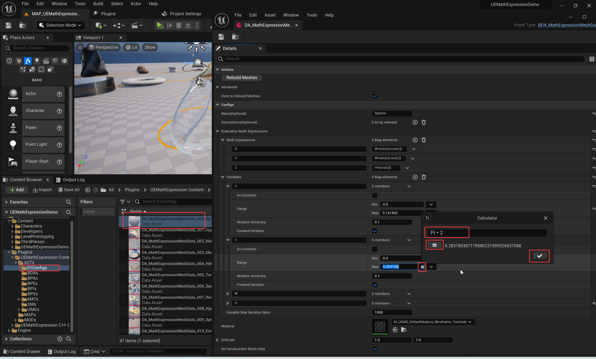

# GALLERY

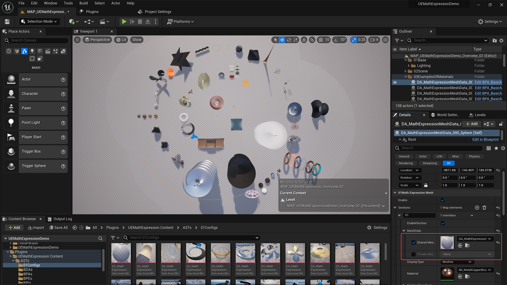

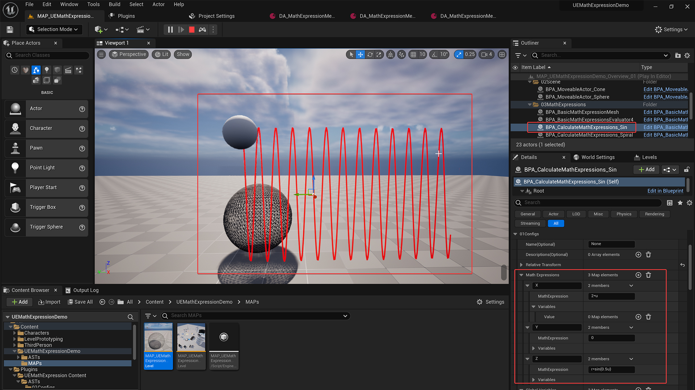

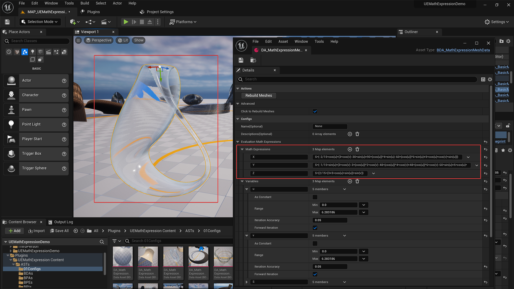

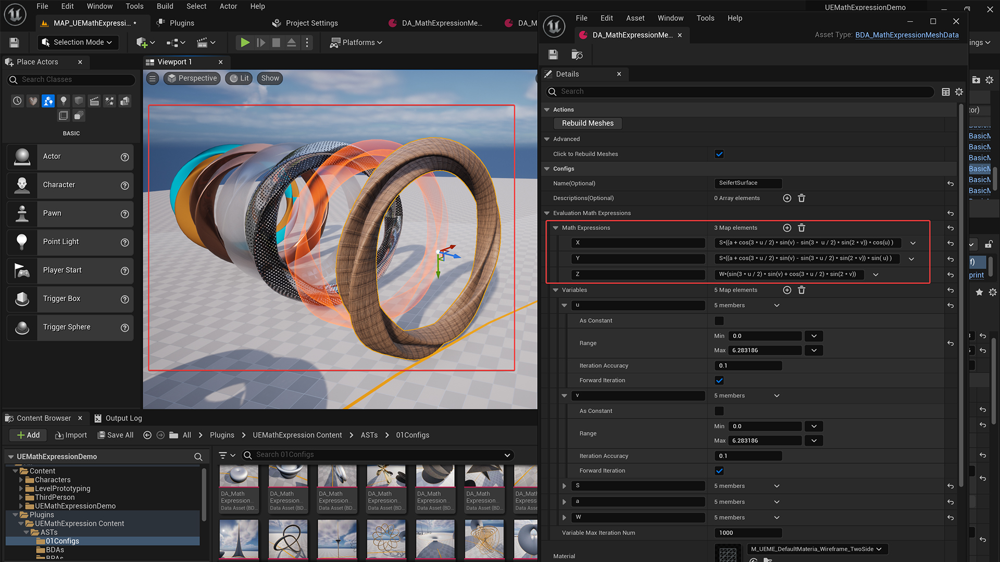

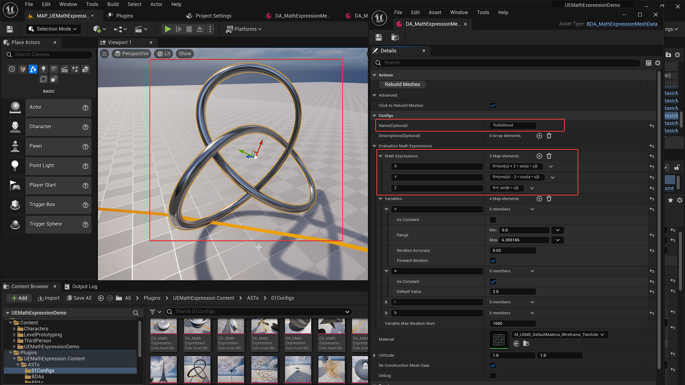
